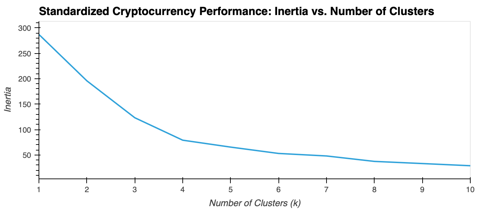
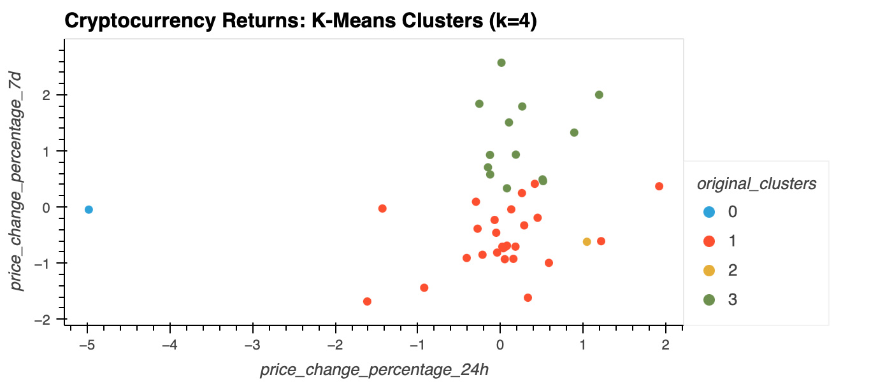
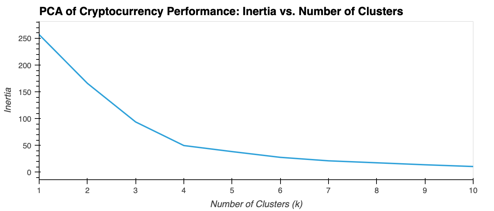
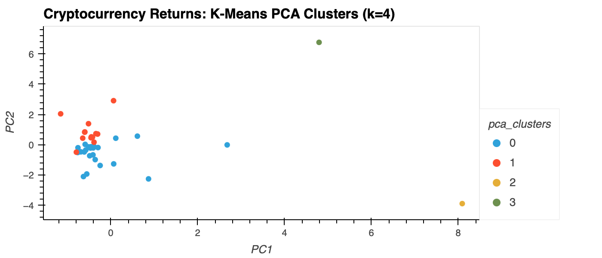
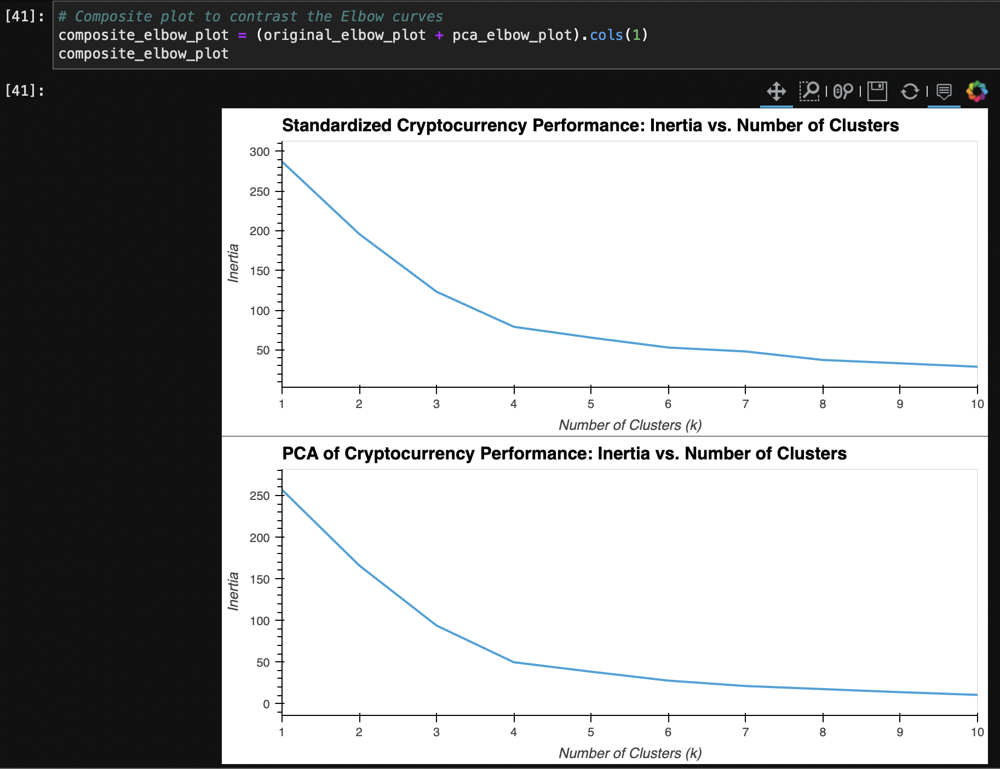
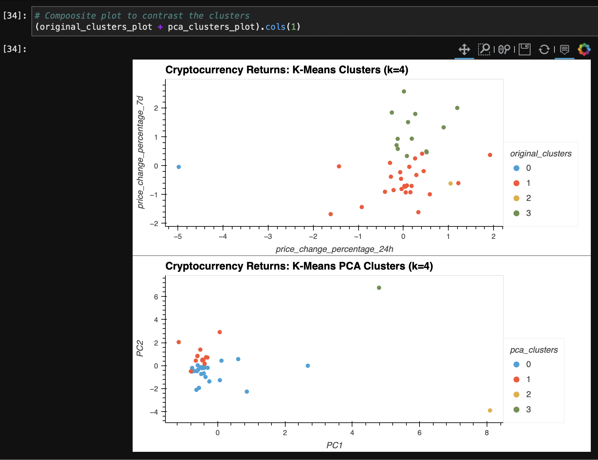

# Module 10 Challenge: Crypto Clustering

## Background

In this Challenge, I will combine my financial Python programming skills with my unsupervised learning skills to assume the role of an advisor at one of the top five financial advisory firms in the world. Competitors are fierce, so I'd want to propose a novel approach to assembling investment portfolios that are based on cryptocurrencies. Instead of basing my proposal on only returns and volatility, I will include other factors that might impact the crypto market&mdash;leading to better performance for my portfolio.

When I presented the idea, my manager loved it! So, I was asked to create a prototype for submitting my crypto portfolio proposal to the company board of directors.
I will create a Jupyter notebook that clusters cryptocurrencies by their performance in different time periods, and then plot the results to visually show the performance to the board.

---

## Files

The 'crypto_investments.ipynb' file contains my analysis of cryptocurrencies clustered by performance a series of across time periods.
* [crypto_investments.ipynb](Code/crypto_investments.ipynb)

The 'crypto_market_data.csv' file contains the price change data of cryptocurrencies in different periods.
* [crypto_market_data.csv](Data/crypto_market_data.csv)

### Finding k with the Elbow Method

In this section, I will find the best value for k by using the Elbow Method.
1. Code the elbow method algorithm to find the best value for k. Use a range from 1 to 11.

2. Plot a line chart with all the inertia values computed with the different values of k to visually identify the optimal value for k.

What is the best value for k?
* *Observations of the elbow plot show that the best value for the number of clusters (k) is 4, the elbow of the curve.*

### Cluster Cryptocurrencies with K-means Using the Original Data

In this section, I will use the K-means algorithm with the best value for k (found in the previous section) in order to cluster the cryptocurrencies according to the price changes of cryptocurrencies provided.

1. Initialize the K-means model with four clusters by using the best value for k.

2. Fit the K-means model using the original data.

3. Predict the clusters to group the cryptocurrencies using the original data. View the resulting array of cluster values.

4. Create a copy of the original data and add a new column with the predicted clusters.

5. Using hvPlot, create a scatter plot by setting `x="price_change_percentage_24h"` and `y="price_change_percentage_7d"`. Color the graph points with the labels found using K-means. Then, add the crypto name in the `hover_cols` parameter to identify the cryptocurrency represented by each data point.

### Optimize Clusters with Principal Component Analysis

In this section, I will perform a principal component analysis (PCA) and reduce the features to three principal components.

1. Create a PCA model instance and set `n_components=3`.

2. Use the PCA model to reduce to three principal components. View the first five rows of the DataFrame.

3. Retrieve the explained variance to determine how much information can be attributed to each principal component.

What is the total explained variance of the three principal components?
* *Observations of the data show a total variance of 89.50% explained by the three principal components, such that dropping the other components would only result in about a 10% loss in variance of the data.*

5. Create a new DataFrame with the PCA data. Be sure to set the `coin_id` index from the original DataFrame as the index for the new DataFrame. Review the resulting DataFrame.

### Find the Best Value for k Using the PCA Data

In this section, I will use the elbow method to find the best value for k by using the PCA data.

1. Code the elbow method algorithm and use the PCA data to find the best value for k. Use a range from 1 to 11.

2. Plot a line chart with all the inertia values computed with the different values of k to visually identify the optimal value for k.

What is the best value for k when using the PCA data? Does it differ from the best k value found using the original data?
* *Observations of the PCA data show that the best value for the number of clusters (k) is 4, the elbow of the curve.*
* *The above plot using three principal components shows an inertia value of 49.665 for k=4, whereas the k value of the original data correlated to an inertia of 79.022.*

### Cluster Cryptocurrencies with K-means Using the PCA Data

In this section, I will use the PCA data and the K-means algorithm with the best value for k (found in the previous section) in order to cluster the cryptocurrencies according to the principal components.

1. Initialize the K-means model with four clusters by using the best value for k.

2. Fit the K-means model by using the PCA data.

3. Predict the clusters to group the cryptocurrencies by using the PCA data. View the resulting array of cluster values.

4. Create a copy of the DataFrame with the PCA data and add a new column to store the predicted clusters.

5. Using hvPlot, create a scatter plot by setting `x="PC1"` and `y="PC2"`. Color the graph points with the labels found using K-means. Then, add the crypto name in the `hover_cols` parameter to identify the cryptocurrency represented by each data point.

### Visualize and Compare the Results

I will visually analyze the cluster analysis results by observing the outcome with and without using the optimization techniques.

1. Create a composite plot to compare the elbow curve that you created to find the best value for k with the original data and the PCA data.

2. Create a composite plot to compare the cryptocurrencies clusters using the original data and the PCA data.

After visually analyzing the cluster analysis results, what is the impact of using fewer features to cluster the data by using K-means?
* *Observations of the cluster analysis results shows that using fewer features to cluster the data using K-Means generates more distinct clusters with less variance within each cluster, contrary to using only the standardized data.*

